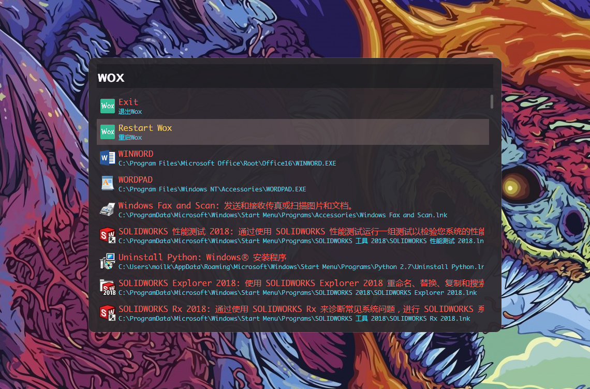
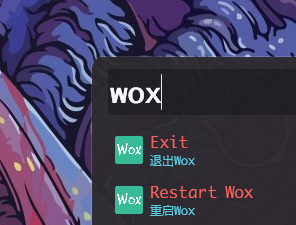

# `monokai-wox-theme`
> 🤩A [Wox](https://github.com/Wox-launcher/Wox) Theme Imitating Monokai

## 📷 Screenshot

## 👇 How to use

### Installing

1. Download `monokai.xmal`
2. Move the file to the Theme directory of wox which usually can be found under

To install the Theme, simply clone this repo or download the .zip version.
Now move the `Atlantis for Wox.xaml` to the Theme directory which usually can be found under `C:\Users\<your user name>\AppData\Local\Wox\app-1.3.xxx\Themes`

### Activate the Theme

1. Open wox setting;
2. Go to the Theme tab, then select `monokai`.